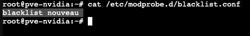
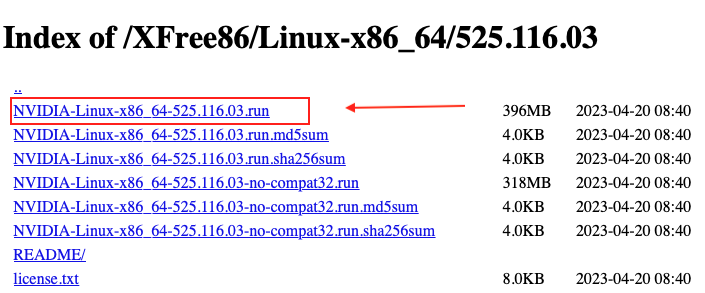
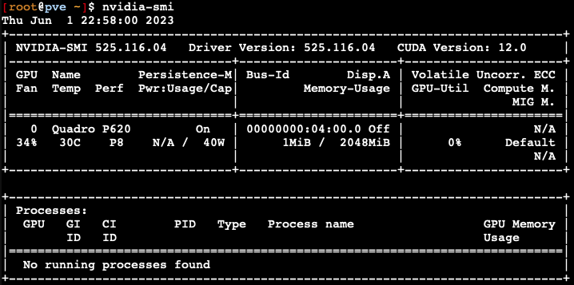
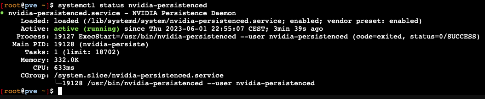
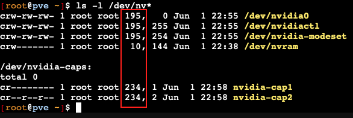

# Instalar drivers de tarjeta grafica NVIDIA en Promox
Antes de empezar quiero agradecer al compañero @juanlu13 por promocionarme la [fuente original](https://forums.plex.tv/t/plex-hw-acceleration-in-lxc-container-anyone-with-success/219289/34?utm_source=pocket_mylist) de la cual se basa este manual. 
#
Este manual vamos a instalar los drivers de nvidia, el servicio persistente y un parche opcional para para eliminar las sesiones de codificación máxima.


- Instalaremos los drives nvidia en el host de Proxmox.
-	Configuraremos los drives para poder usarlos en cualquier LXC.

Para poder realizar la instalación debemos:
<br>
<br>
1- poner en la lista negra el controlador de "nouveau" si no lo tenemos ya.

Lo podemos comprobar asi: 
```
Cat /etc/modprobe.d/blacklist.conf
```
Si no muestra: blacklist nouveau



```
echo "blacklist nouveau" >> /etc/modprobe.d/blacklist.conf
```
```
reboot
```

2- Asegurarnos que tenemos estos repositorios configurados:

(*Si tenemos instalado el script post instalación de  [tteck](https://tteck.github.io/Proxmox/) o el de [xshok](https://github.com/extremeshok/xshok-proxmox), podemos saltarnos este paso ya que nos es necesario puesto que están añadidos estos repositorios.*)

```
nano /etc/apt/sources.list
```
```
deb http://ftp.debian.org/debian bullseye main contrib
deb http://ftp.debian.org/debian bullseye-updates main contrib
deb http://security.debian.org/debian-security bullseye-security main contrib
deb http://download.proxmox.com/debian/pve bullseye pve-no-subscription
```
Actualizamos los paquetes y promox

```
apt update && apt dist-upgrade -y
```

Antes de empezar, instalamos dos paquetes que necesitaremos, git y los encabezados del kernel para poder instalar los drivers:

```
apt-get install git
```
```
apt-get install -qqy pve-headers-`uname -r` gcc make 
```
## 1 - Instalar los drivers de NVIDIA en el host de Proxmox

Para empezar, necesitamos saber cual es el ultimo controlador estable disponible:*
<br>

(*Si vamos a instalar el parche para saltarnos el limite de codificaciones máximas, tenemos que tener en cuenta que ese parche este disponible para la versión del controlador que vamos a instalar.*) Podemos verlo [aquí](https://github.com/keylase/nvidia-patch).
```
https://download.nvidia.com/XFree86/Linux-x86_64/latest.txt 
```
Cuando nos muestre el resultado, copiamos el numero y los sustituimos por “/latest.txt”

Por ejemplo así: 

```
https://download.nvidia.com/XFree86/Linux-x86_64/525.116.03/
```

Una vez dentro del directorio copiamos el enlace del instalador que termina con la extensión .run





Por ejemplo:
```
https://download.nvidia.com/XFree86/Linux-x86_64/525.116.03/NVIDIA-Linux-x86_64-525.116.03.run
```

#### Empezamos con la instalación:

```
mkdir /opt/nvidia
```
```
cd /opt/nvidia
```
Descargamos el controlador que copiamos antes.
```
wget https://download.nvidia.com/XFree86/Linux-x86_64/525.116.03/NVIDIA-Linux-x86_64-525.116.03.run
```
Le damos permisos de ejecución.
```
chmod +x NVIDIA-Linux-x86_64-525.116.03.run
```
ejecutamos.
```
./NVIDIA-Linux-x86_64-525.116.03.run --no-questions --ui=none --disable-nouveau
```
Una vez terminado reiniciamos.
```
reboot
```
Una vez reiniciado proxmox continuamos con la intalación. Ejecutamos:
```
/opt/nvidia/NVIDIA-Linux-x86_64-525.116.03.run --no-questions --ui=none
```

Ahora añadimos a etc/modules:
```
nano /etc/modules-load.d/modules.conf
```
```
nvidia
nvidia_uvm
```
Guardamos:
ctrl + x.

<br>

Actualizamos initramfs:
```
update-initramfs -u
```
A continuación creamos reglas para cargar los controladores en el arranque para nvidia y nvidia_uvm:
```
nano /etc/udev/rules.d/70-nvidia.rules
```
Pegamos:
```
# /etc/udev/rules.d/70-nvidia.rules
# Create /nvidia0, /dev/nvidia1 … and /nvidiactl when nvidia module is loaded
KERNEL=="nvidia", RUN+="/bin/bash -c '/usr/bin/nvidia-smi -L'"
#
# Create the CUDA node when nvidia_uvm CUDA module is loaded
KERNEL=="nvidia_uvm", RUN+="/bin/bash -c '/usr/bin/nvidia-modprobe -c0 -u'"
```
Guardamos: ctrl + x

<br>

Ahora instalamos NVIDIA driver persistence:
```
Install GitHub - NVIDIA/nvidia-persistenced: NVIDIA driver persistence daemon
git clone https://github.com/NVIDIA/nvidia-persistenced.git
cd nvidia-persistenced/init
./install.sh
```
Comprobamos que el controlador este instalado y el servicio este ejecutándose:
```
nvidia-smi
```

```
systemctl status nvidia-persistenced
```


Ahora parcheamos el controlador nvidia para eliminar las sesiones de codificación máxima:
```
cd /opt/nvidia
```
```
git clone https://github.com/keylase/nvidia-patch.git
```
```
cd nvidia-patch
```
```
./patch.sh
```
## Añadir la grafica NVIDIA a un LXC.

Necesitamos obtener estos datos:
```
ls -l /dev/nv*
```

